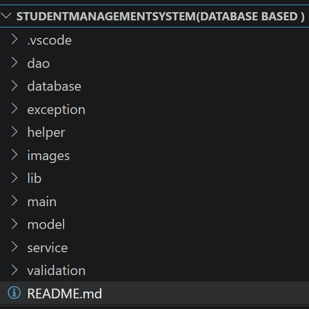
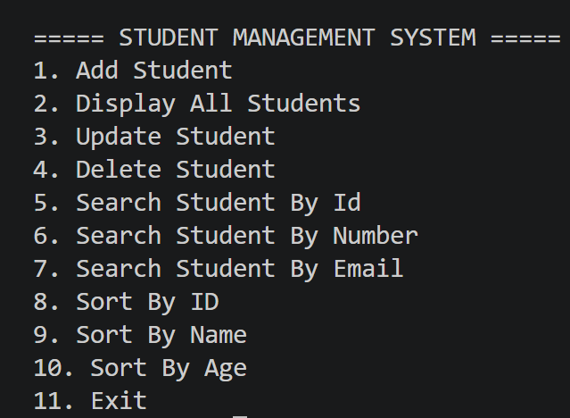
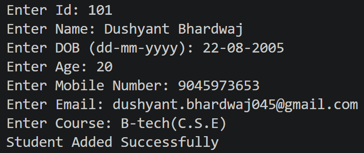
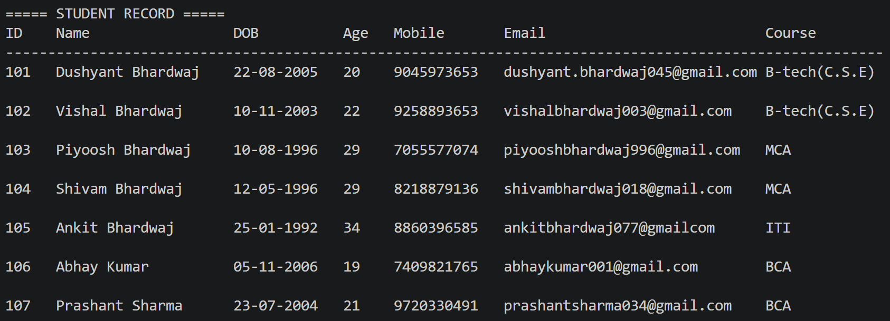
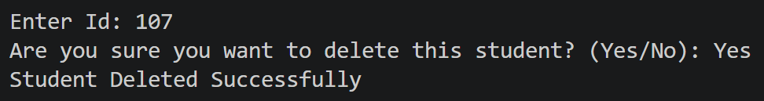
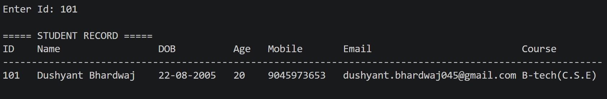
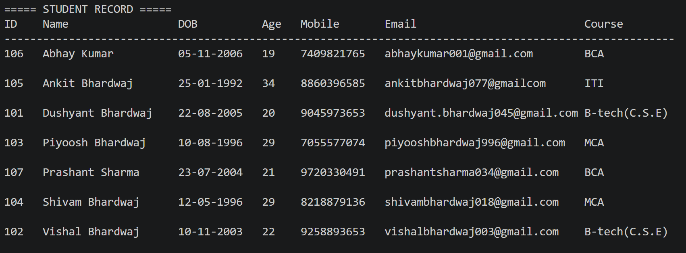
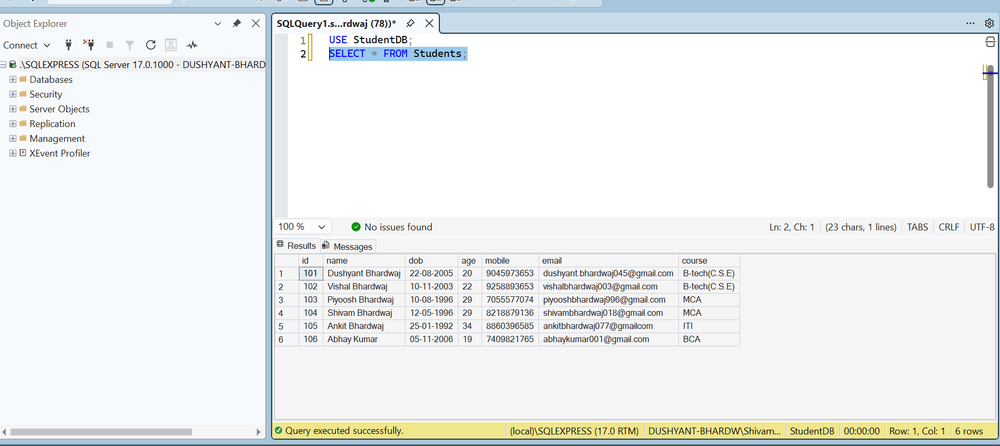

# Student Management System

A professional console-based Student Management System developed using Java, JDBC, SQL Server, and Layered Architecture.

---

## Features

- Add Student
- Display Students
- Update Student
- Delete Student
- Search Student By ID
- Search Student By Mobile Number
- Search Student By Email
- Sort Students By
    - ID
    - Name
    - Age
- Input Validation
- Custom Exception Handling
- Layered Architecture (MVC)
- JDBC CRUD Operations
- Reusable DAO Helper Methods

---

## Technologies Used

- Java
- JDBC
- SQL Server
- VS Code
- Maven (Optional)
- Git

---

## Project Structure

Model
↓

DAO
↓

Service
↓

Main (Controller)

---

## Database Structure

Table Name

Students

Columns

- id
- name
- dob
- age
- mobile
- email
- course

---

## Architecture

MVC + Layered Architecture

Model

Student.java

↓

DAO

StudentDAO.java

↓

Service

StudentService.java

↓

Controller

Main.java

---

## Architecture Diagram

USER
  │
  ▼
Main.java
  │
  ▼
StudentService.java
  │
  ▼
StudentDAO.java
  │
  ▼
SQL Server Database

------

## Detailed MVC Diagram

USER
   │
   ▼
Main.java (Controller)
   │
   ▼
StudentService.java (Business Logic)
   │
   ▼
StudentDAO.java (DAO)
   │
   ▼
SQL Server Database

------

## Flow Diagram

User
 ↓
Main
 ↓
InputHelper
 ↓
StudentValidator
 ↓
StudentService
 ↓
StudentDAO
 ↓
DBConnection
 ↓
SQL Server

------
## Class Responsibilities

| Class             | Responsibility      |
| ----------------- | ------------------- |
| Main              | Controller          |
| StudentService    | Business Logic      |
| StudentDAO        | Database Operations |
| Student           | Model               |
| DBConnection      | Database Connection |
| InputHelper       | User Input          |
| StudentValidator  | Validation          |
| Custom Exceptions | Exception Handling  |

------

## Skills Demonstrated

Java OOP

JDBC

SQL Server

MVC Architecture

Layered Architecture

DAO Pattern

Exception Handling

Input Validation

Generic Helper Methods

Clean Code

SOLID (Basic)

Code Reusability

-----

## Design Patterns

DAO Pattern

Helper Pattern

Layered Architecture

---

## Exception Handling

DuplicateStudentException

StudentNotFoundException

InvalidStudentDataException

---

## Validation

Name Validation

Age Validation

Email Validation

Mobile Validation

DOB Validation

Course Validation

---

## Future Improvements

Logging

JavaDocs

Servlet + JSP

HTML

CSS

Bootstrap

Spring Boot

REST API

Hibernate

---

## Resume Description

Student Management System developed using Java, JDBC and SQL Server following MVC and Layered Architecture. Implemented CRUD operations, DAO Pattern, reusable helper methods, custom exception handling, input validation, sorting, searching and modular architecture.

-----

## Interview Highlights

Highlights

✔ Layered Architecture

✔ MVC Pattern

✔ DAO Pattern

✔ JDBC CRUD

✔ SQL Server

✔ Custom Exceptions

✔ Generic Search

✔ Generic Sorting

✔ Input Validation

✔ Clean Code

✔ Helper Methods

✔ Reusable Components

✔ Console Based Project

-----
## Folder Structure

## Home Screen

## Add Student

## Display Students

## Delete Student

## Search Student

## Sort Students

## Database

## Author

Dushyant Bhardwaj